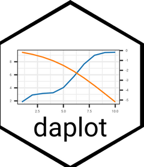

<!-- README.md is generated from README.Rmd. Please edit that file -->

```{r, include = FALSE}
knitr::opts_chunk$set(
  collapse = TRUE,
  comment = "#>",
  fig.path = "man/figures/README-",
  out.width = "100%"
)
```

# daplot 


<!-- badges: start -->
[](https://lifecycle.r-lib.org/articles/stages.html#experimental)
[](https://github.com/TeroJii/daplot/actions/workflows/R-CMD-check.yaml)
<!-- badges: end -->

The goal of daplot is to provide a simplified interface for creating a plot with a dual axis in ggplot2.

## Installation

You can install the development version of daplot from [GitHub](https://github.com/) with:

``` r
# install.packages("pak")
pak::pak("TeroJii/daplot")
```

## Motivation

The [ggplot2](https://ggplot2.tidyverse.org/) package provides an incredibly rich and extensive functionality for creating a huge variety of plots.
Let's take the following visualization as an example:

```{r ggplot-example}
library(ggplot2)

mtcars |> 
  ggplot(aes(x = mpg)) +
  geom_line(aes(y = wt), color = "blue") +
  geom_line(aes(y = qsec), color = "red") +
  scale_y_continuous(
    name = "wt",
    sec.axis = sec_axis(~ ., name = "qsec")
  )
```

This produces an elegant visualization which allows us to compare two variables as a function of a third one. However, as we can see, the magnitude of the variables in absolute units is quite different. In some cases we might want to compare two variables with different scales more easily. This requires scaling of one of the variables to fit the scale of the other variable. This is possible with ggplot2, but it requires some additional steps and calculations. This is where the `daplot` function comes in handy. It provides a simplified interface for creating dual-axis plots without the need for manual scaling.

```{r example}
library(daplot)

mtcars |> 
  daplot(mpg, wt, qsec)
```

## Using other plotting geoms

The default geom used in `daplot` is `ggplot2::geom_line`. However, you can (basically) use any geom you like by specifying the `y1_geom` and `y2_geom` arguments. For example, you can use `ggplot2::geom_point` to create a scatter plot:

```{r, example-points}
set.seed(123)

data.frame(
  x = 1:10,
  y1 = rnorm(10, 10, 2),
  y2 = rnorm(10, 100, 20)
) |> 
  daplot(x, y1, y2, y1_geom = ggplot2::geom_point, y2_geom = ggplot2::geom_point)
```

Specifying `y2_geom` is actually not needed here, as it defaults to the same geom as `y1_geom` if not provided.

### Combining different geoms

We can also use `daplot` to combine different plot geoms for the two variables.

```{r, bar-plot}

data.frame(
  year = 2000:2010,
  sales = c(100, 120, 150, 130, 170, 160, 180, 200, 220, 210, 230),
  profit = c(10, 15, 20, 18, 25, 22, 30, 35, 40, 38, 45)
) |> 
  daplot(
    year, 
    sales, 
    profit, 
    y1_geom = ggplot2::geom_col, 
    y2_geom = ggplot2::geom_line, 
    y1_label = "Sales (1000 €)", 
    y2_label = "Profit (1000 €)"
  )

```

