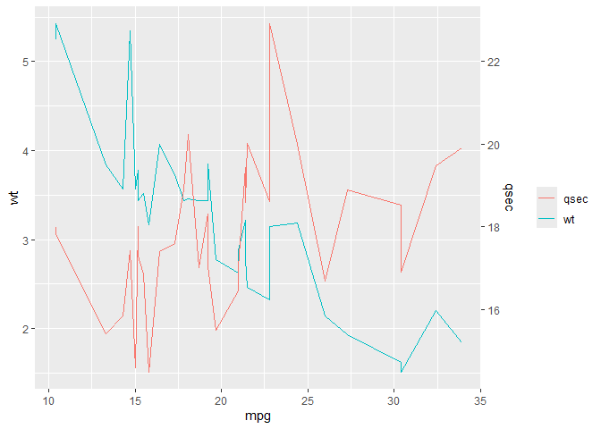

<!-- README.md is generated from README.Rmd. Please edit that file -->

# daplot

<!-- badges: start -->

[](https://lifecycle.r-lib.org/articles/stages.html#experimental)
<!-- badges: end -->

The goal of daplot is to provide a simplified interface for creating a
plot with a dual axis in ggplot2.

## Installation

You can install the development version of daplot from
[GitHub](https://github.com/) with:

``` r
# install.packages("pak")
pak::pak("TeroJii/daplot")
```

## Example

This is a basic example which shows you how to solve a common problem:

``` r
library(daplot)

mtcars |> 
  daplot(mpg, wt, qsec, y1_label = "test label")
```


